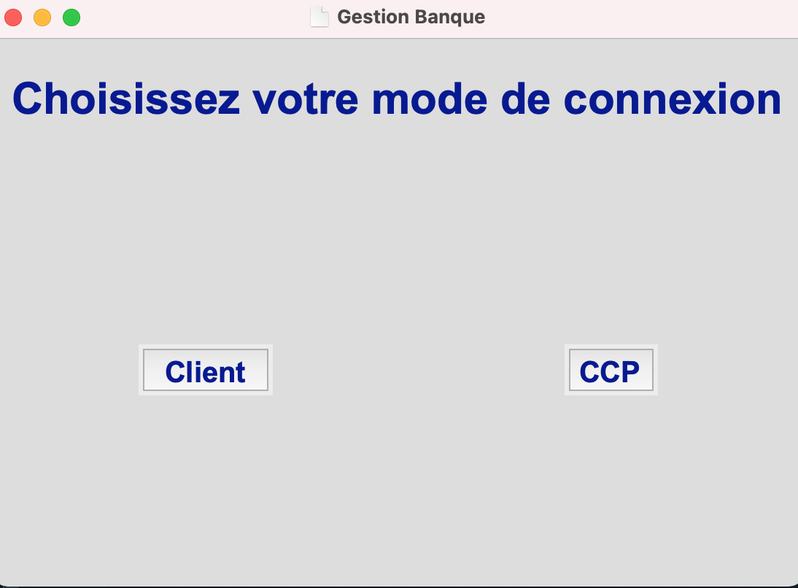
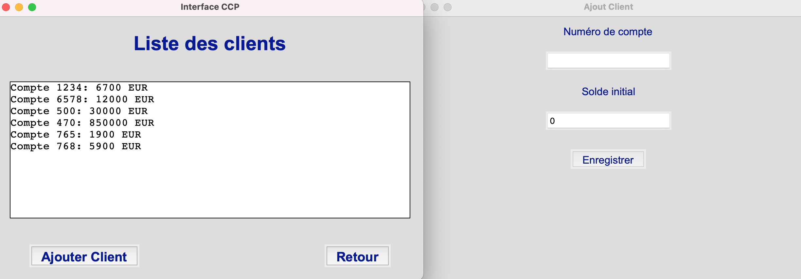

# PyBank - Banking Management Application

PyBank is a user-friendly banking management application built with Python's `tkinter` library. It allows users to manage client accounts, add new clients, and view account details. The application has two main user interfaces: one for regular clients and one for CCP (Centralized Client Processing).

---

## Features

- **User-Friendly UI**: Intuitive and easy-to-use graphical interface.
- **Client Management**: Add, view, and manage client accounts.
- **Dynamic Data Handling**: Real-time updates of client information.
- **Responsive Design**: Scalable to different screen sizes.

---

## Project Structure

```bash
PyBank/
├── src/
│   ├── main.py          # Main application entry point
│   ├── fenetres.py      # Handles all UI windows
│   ├── utils.py         # Utility functions for styling and functionality
│   ├── styles.py        # Placeholder for advanced styling utilities
├── resources/
│   └── logo.ico         # Application icon
├── requirements.txt     # Required Python dependencies
└── README.md            # Project documentation
```

---

## Installation

1. Clone the repository:

   ```bash
   git clone https://github.com/HaddarMelek/PyBank.git
   cd PyBank
   ```

2. Install the required dependencies:

   ```bash
   pip install -r requirements.txt
   ```

3. Run the application:

   ```bash
   python src/main.py
   ```

---

## Usage

1. Launch the application.
2. Choose a mode:
   - **Client Mode**: For viewing and interacting with individual client accounts.
   - **CCP Mode**: For managing all client accounts (add new accounts, view existing ones).
3. Follow the on-screen prompts to manage client data.

---

## Screenshots

### Main Menu


### CCP Interface


### Client Interface


---

## Future Improvements

- Add database integration for persistent client data.
- Enhance the UI with additional styling and animations.
- Add authentication for secure login.
- Introduce transaction management features.
- Export client data to CSV or Excel.

---

